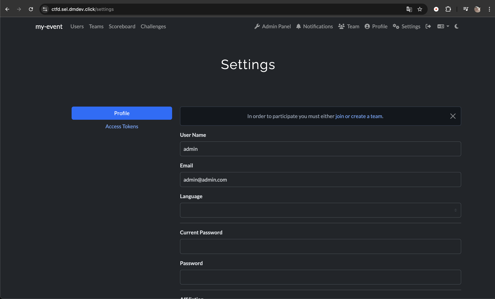
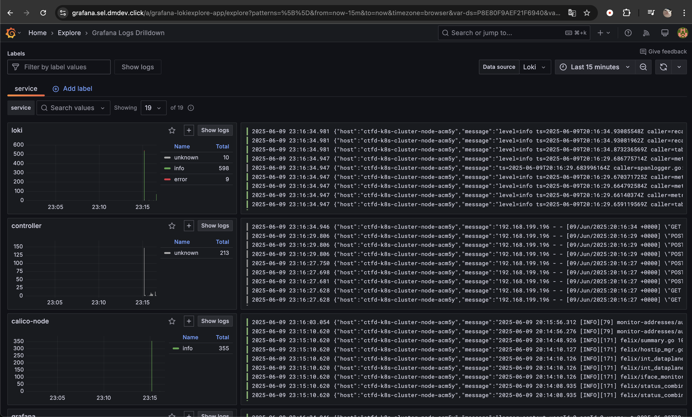
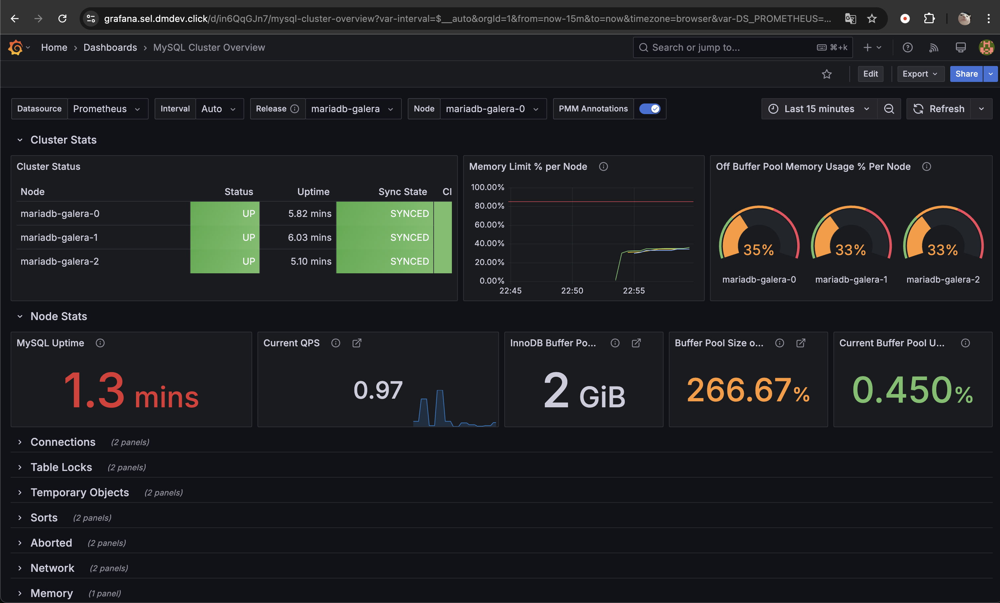
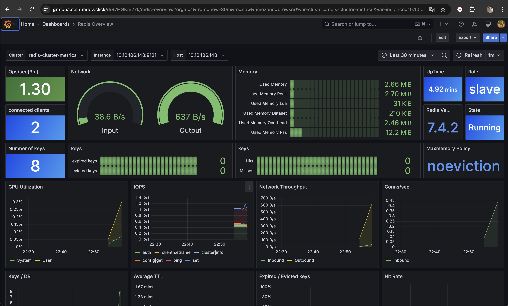

# Отчет

Для запуска CTFD используется облачный провайдер Selectel, инфраструктура описана с помощью Terraform и Ansible.

## Запуск проекта

Для запуска проекта нужно

1. Активировать виртуальное окружение python с установленным ansible.
2. Перейти в каталог terraform `cd terraform`
3. Создать ssh ключ `ssh-keygen -t ed25519 -a 32 -f ctfd-key -C "CTFD key"`
4. Инициализировать Terraform
`terraform init`
5. Заполнить переменные Terraform `terraform.tfvars`
```
project_name                 = "ctfd"
ssh_public_key_path          = "../ctfd-key.pub"
selectel_pool                = "ru-7"
selectel_segment             = "ru-7a"
domain_zone                  = "example.com."
selectel_password            = ""
selectel_username            = ""
selectel_domain_name         = ""
project_serviceuser_username = ""
project_serviceuser_password = ""
mariadb_root_password        = ""
mariadb_mariabackup_password = ""
mariadb_password             = ""
redis_password               = ""
```
6. Запустить `terraform apply` (в окружении должен быть доступен Ansible)
7. Получить kubeconfig для подключения к кластеру `terraform output -raw kubeconfig`
8. Ctfd будет доступен на сабдомене `ctfd.`, Grafana на сабдомене `grafana.`

## Установленные сервисы

В результате в созданный Kubernetes кластер будут установлены:

- ingress nginx;
- cert-manager;
- csi-driver-nfs
- kube-prometheus-stack (Prometheus Operator, Grafana, Node Exporter)
- mariadb-galera (кластер из 3 подов)
- redis-cluster (клатер из 6 подов)
- loki
- vector
- ctfd

Также будет создана виртуальная машина, на которую будет установлен nfs-server.

## Демонстрация работы



                                Работающий ctfd



                        Собранные логи с подов в кластере



                        Дашборд MySQL кластера в Grafana



                        Дашборд Redis кластера в Grafana
